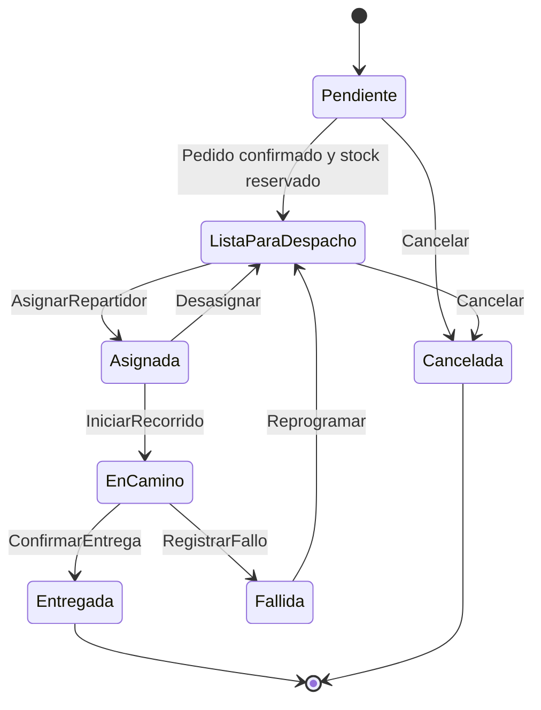

# Diagrama de estados de Delivery

El flujo diseñado es la transición **ListaParaDespacho a Asignada**.

```mermaid
stateDiagram-v2
    [*] --> Pendiente
    Pendiente --> ListaParaDespacho: Pedido confirmado y stock reservado
    ListaParaDespacho --> Asignada: AsignarRepartidor
    Asignada --> ListaParaDespacho: Desasignar
    Asignada --> EnCamino: IniciarRecorrido
    EnCamino --> Entregada: ConfirmarEntrega
    EnCamino --> Fallida: RegistrarFallo
    Fallida --> ListaParaDespacho: Reprogramar
    Pendiente --> Cancelada: Cancelar
    ListaParaDespacho --> Cancelada: Cancelar
    Entregada --> [*]
    Cancelada --> [*]
```
