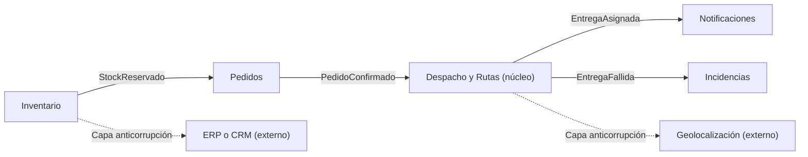

# Mapa de contextos

Las flechas con línea continua son eventos entre contextos propios. Las de línea punteada pasan por una capa anticorrupción hacia sistemas externos.

```mermaid
flowchart LR
    Pedidos["Pedidos"]
    Inventario["Inventario"]
    Despacho["Despacho y Rutas (núcleo)"]
    Notif["Notificaciones"]
    Inc["Incidencias"]
    Geo["Geolocalización (externo)"]
    ERP["ERP o CRM (externo)"]

    Inventario -->|"StockReservado"| Pedidos
    Pedidos -->|"PedidoConfirmado"| Despacho
    Despacho -->|"EntregaAsignada"| Notif
    Despacho -->|"EntregaFallida"| Inc
    Despacho -.->|"Capa anticorrupción"| Geo
    Inventario -.->|"Capa anticorrupción"| ERP
```
